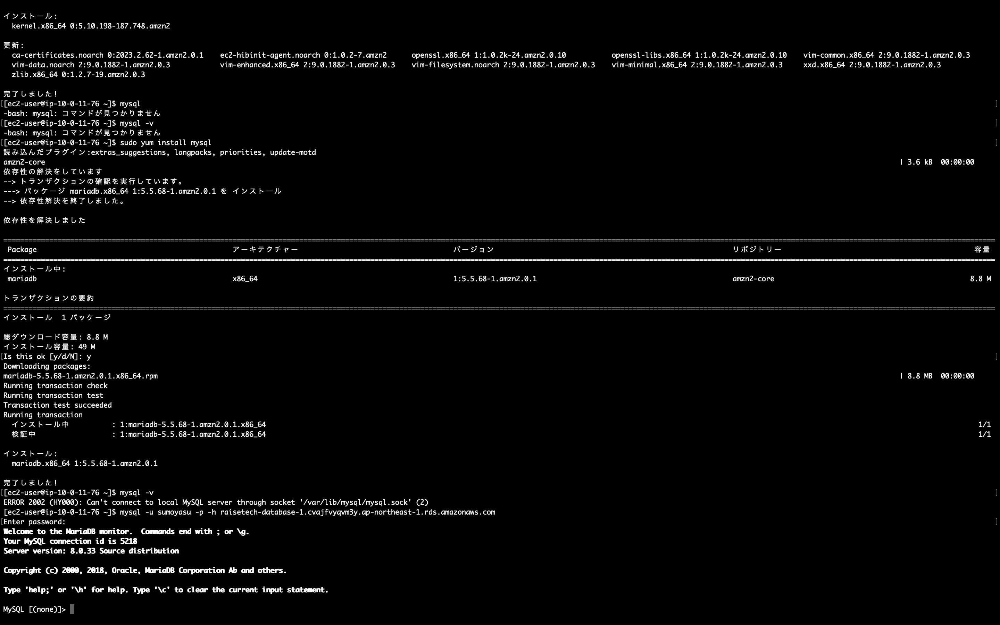

# 第4回　講座・課題で学んだこと

## VPCの作成

- 作成するリソース：VPCなど
- AZ:2つ　ap-northeast-1aとap-northeast-1c
- サブネット：各ＡＺにパブリックサブネットとプライベートサブネットを各1個ずつ作成
- NATゲートウェイ、VPCエンドポイントはなし
- DNSオプションは全てチェックを入れる
　
## EC2の作成

- サーバーのOS：Amazon Linux 2
- インスタンスタイプ：t2.micro
- 上で作成したVPCのap-northeast-1a　パブリックサブネットに配置
- 自動割り当てパブリックIPは有効にする
- ストレージは変更なし
- セキュリティグループのインバウンドルール設定:全てのソースからのSSH接続を許可
- 今回キーペアは新規で作成

## RDSの作成

- 標準作成、無料利用枠を選択
- DBはMySQLで作成
- DB名、マスターユーザー名、パスワードを設定
- ストレージの自動スケーリングは外す
- VPCは課題で作成したものを選択
- サブネットグループの設定：作成したVPCを選択し、AZはap-northeast-1aとap-northeast-1cを選択、サブネットはそれぞれのAZ上のプライベートサブネットを選択
- セキュリティグループのインバウンドルール設定
 
    タイプ：MYSQL/Aurora　プロトコル：TCP　ポート：3306　
    ソース：カスタム/上記で作成したEC2のセキュリティグループ
　
## EC2とRDSの接続

- MACのターミナルから作成したEC2にSSH接続
- $ sudo yum install mysql　のコマンドでmysqlをインストール
- インストール完了後、以下のコマンド　$ mysql -u ユーザー名 -p -h RDSのエンドポイント
- パスワードはRDS作成時に設定したものを入力

## 躓いたところ

- EC2へのSSH接続においてプライベートIPで接続しようとしてサーバーへの接続が上手くいかなかった
- 原因：EC2インスタンス起動時の設定ミス、自動割り当てパブリックIPを無効化にしていた
- 解決策：パブリックIPの自動割り当て設定は後で変更できないようだったため、再度EC2を新規で作成→パブリックIPを利用して無事にSSH接続完了
- 今回は特にEC2の内部設定をいじっていなかったため新規作成が痛くなかったが、ある程度設定が進んでしまっていた場合はElasticIPアドレスのアタッチも考慮したかも・・・
